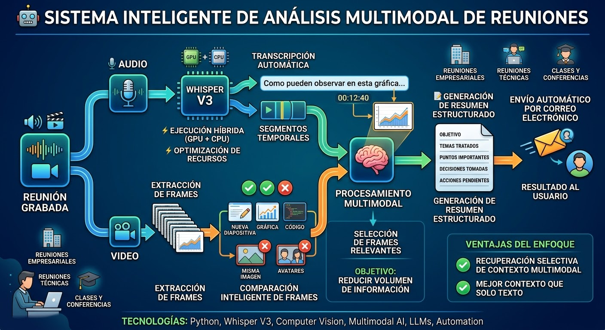

## Tabla de Contenidos
1. [Descripcion General](#descripcion-general)
2. [Problema](#problema)
3. [Solucion](#solucion)
4. [Arquitectura](#arquitectura)
5. [Stack Tecnologico](#stack-tecnologico)
6. [Optimizacion](#optimizacion)
7. [Casos de Uso](#casos-de-uso)
8. [Desafios y Aprendizajes](#desafios-y-aprendizajes)
9. [Reflexiones Finales](#reflexiones-finales)

---

## Descripcion General

Sistema de procesamiento multimodal disenado para analizar grabaciones completas de reuniones mediante audio + video, extraer unicamente la informacion visual relevante y generar automaticamente un resumen estructurado de la reunion.

El sistema combina transcripcion automatica mediante Whisper V3, procesamiento de video, analisis y seleccion inteligente de frames, procesamiento multimodal mediante modelos de lenguaje y automatizacion del envio del resultado por correo electronico.

El objetivo principal es convertir una grabacion de una reunion en un documento estructurado que permita conocer que ocurrio, que se discutio, que decisiones se tomaron y cuales fueron los puntos importantes, sin necesidad de revisar manualmente toda la grabacion.

### Caracteristicas principales

- Transcripcion automatica de reuniones mediante Whisper V3
- Ejecucion de Whisper utilizando GPU + CPU
- Optimizacion de utilizacion de recursos de computo
- Procesamiento de grabaciones de video
- Extraccion automatica de frames
- Comparacion de frames para detectar cambios visuales relevantes
- Eliminacion de frames redundantes
- Identificacion de contenido visual que aporta contexto
- Procesamiento multimodal de audio + imagenes
- Generacion automatica de resumenes
- Estructuracion de la informacion obtenida
- Envio automatico del resultado por correo electronico
- Pipeline automatizado de principio a fin
- Soporte para procesamiento hibrido CPU/GPU

---

## Problema

Las reuniones virtuales generan una gran cantidad de informacion que normalmente queda almacenada unicamente como una grabacion.

Una reunion de una hora puede contener:

- Audio
- Conversaciones
- Presentaciones
- Documentos compartidos
- Codigo
- Tablas
- Graficas
- Cambios de pantalla
- Interfaz de la plataforma
- Avatares
- Elementos visuales repetidos

El problema es que no todos los frames del video contienen informacion util.

Por ejemplo:

```
Frame 001 → Presentacion
Frame 002 → Presentacion
Frame 003 → Presentacion
Frame 004 → Presentacion
Frame 005 → Presentacion
Frame 006 → Presentacion
Frame 007 → Nueva diapositiva
Frame 008 → Nueva diapositiva
Frame 009 → Nueva diapositiva
```

Enviar todos estos frames a un modelo multimodal seria innecesariamente costoso y consumiria una cantidad considerable de recursos.

Por esta razon, el sistema implementa una etapa especifica de seleccion de frames relevantes.

---

## Solucion

El sistema divide el problema en diferentes etapas:

```
┌─────────────────────┐
│  Grabacion reunion  │
└──────────┬──────────┘
           │
    ┌──────┴──────┐
    ▼             ▼
 Audio          Video
    │             │
    ▼             ▼
Whisper     Extraccion
  V3          Frames
    │             │
    ▼             ▼
Transcr.    Comparacion
    │             │
    │             ▼
    │        Frames OK
    │             │
    └──────┬──────┘
           ▼
    Procesamiento
     multimodal
           │
           ▼
      Resumen
    estructurado
           │
           ▼
         Email
```

La arquitectura busca reducir el volumen de informacion procesada antes de llegar al modelo encargado de generar el resumen.

---

## Arquitectura

### 1. Ingesta de la grabacion

El sistema recibe una grabacion de una reunion.

La grabacion contiene dos fuentes principales de informacion:

```
Video
 ├── Audio
 └── Informacion visual
```

Ambas fuentes se procesan de manera independiente para posteriormente combinarlas.

### 2. Transcripcion mediante Whisper V3

Para convertir el contenido hablado en texto se utilizo Whisper V3.

Whisper permite transformar el audio de la reunion en una transcripcion que posteriormente puede ser procesada por el sistema de inteligencia artificial.

El flujo es:

```
Audio
  ↓
Whisper V3
  ↓
Transcripcion
  ↓
Segmentos temporales
```

Los segmentos temporales son especialmente importantes porque permiten relacionar lo que se esta diciendo con lo que aparece visualmente en pantalla.

### 3. Optimizacion de Whisper: CPU + GPU

Uno de los puntos importantes de la implementacion fue la optimizacion del uso de recursos de hardware.

El procesamiento no se ejecuto exclusivamente sobre GPU.

Se configuro Whisper para aprovechar GPU y CPU, utilizando las capacidades disponibles en la libreria de inferencia para distribuir y ajustar el uso de recursos.

Conceptualmente:

```
   Whisper V3
       │
  ┌────┴────┐
  ▼         ▼
 GPU       CPU
  │         │
  └────┬────┘
       ▼
 Transcripcion
```

Durante las pruebas, el procesamiento mostro una utilizacion aproximada de:

- GPU → ~80%
- CPU → utilizacion significativa

La prioridad no fue unicamente aumentar el uso de GPU, sino encontrar un equilibrio entre velocidad de inferencia y utilizacion eficiente del hardware disponible.

> La optimizacion se realizo principalmente mediante la configuracion de la libreria y sus parametros de ejecucion, en lugar de realizar optimizaciones algoritmicas de bajo nivel sobre el codigo del modelo.

### 4. Procesamiento del video

Mientras Whisper procesa el audio, el video se procesa de manera independiente.

El sistema extrae frames a intervalos determinados para obtener una representacion visual de la reunion. El procesamiento de imagenes se realiza utilizando **scikit-image (skimage)**, una libreria de Python para procesamiento de imagenes que proporciona herramientas eficientes para analisis visual y comparacion de frames.

```
Video
  │
  ▼
Extraccion de frames
  │
  ├── Frame 1
  ├── Frame 2
  ├── Frame 3
  ├── ...
  └── Frame N
```

Sin embargo, almacenar y analizar todos los frames no es eficiente. Por eso se introduce una etapa de reduccion.

### 5. Seleccion inteligente de frames

Una reunion puede mantener la misma pantalla durante varios minutos.

Si todos los frames representan practicamente la misma informacion, procesarlos individualmente no aporta valor adicional.

El sistema compara los frames y determina cuales representan cambios suficientemente relevantes.

```
Frames originales

████████████████████████████
████████████████████████████
████████████████████████████
████████████████████████████
████████████████████████████
████████████████████████████
████████████████████████████

              ↓

Comparacion

              ↓

Frames relevantes

████████████████████████████
                         ↓
████████████████████████████
                         ↓
████████████████████████████
```

Esto reduce significativamente la cantidad de imagenes que posteriormente deben ser procesadas por el modelo multimodal.

### 6. Comparacion de frames con scikit-image

La comparacion tiene como objetivo detectar cambios visuales relevantes utilizando **scikit-image (skimage)**.

El sistema utiliza varias tecnicas de procesamiento de imagenes:

**Conversion a escala de grises:**
```python
from skimage import color

gray_frame = color.rgb2gray(frame)
```

**Calculo de diferencia estructural (SSIM):**
```python
from skimage.metrics import structural_similarity as ssim

score = ssim(frame_a, frame_b)
if score < threshold:
    # Cambio significativo detectado
    relevant_frames.append(frame_b)
```

**Deteccion de bordes y caracteristicas:**
```python
from skimage.feature import canny, corner_harris

edges = canny(gray_frame)
corners = corner_harris(gray_frame)
```

No todo cambio de frame implica informacion nueva. El umbral de SSIM se configura para ignorar cambios menores (animaciones de cursor, transiciones suaves) y conservar solo cambios estructurales significativos (nueva diapositiva, nuevo documento, cambio de aplicacion).

**Cambio irrelevante:**

```
Frame A → Frame B

Misma diapositiva
Misma informacion
Misma interfaz

Se descarta.
```

**Cambio relevante:**

```
Frame A → Frame B

Diapositiva 1
       ↓
Diapositiva 2

Se conserva.
```

Otros ejemplos de informacion visual potencialmente relevante:

- Nueva diapositiva
- Nueva grafica
- Cambio de documento
- Codigo
- Tabla
- Diagrama
- Resultados
- Informacion textual
- Cambios importantes en una aplicacion compartida

### 7. Procesamiento multimodal

Una vez obtenidos la transcripcion y los frames relevantes, ambas fuentes se combinan para generar una representacion mas completa de la reunion.

Esto permite evitar un problema comun de los sistemas basados unicamente en transcripcion.

**Ejemplo:**

Una persona puede decir: "Como pueden observar en esta grafica..."

La transcripcion por si sola no contiene la grafica. El frame correspondiente permite recuperar el contexto visual mencionado durante la conversacion.

```
Audio:
"Como pueden observar en esta grafica..."

            +

Imagen:
[Grafica mostrada durante la reunion]

            ↓

Contexto completo
```

### 8. Contexto temporal

Otro componente importante es mantener la relacion temporal entre el audio y las imagenes.

```
00:12:35
"Vamos a revisar los resultados del ultimo mes."

        ↓

00:12:40

[Frame relevante]
Grafica de resultados

        ↓

00:13:05

"Como pueden observar..."
```

Esto permite que el sistema no solamente conozca que aparecio en pantalla, sino tambien cuando aparecio y que se estaba hablando en ese momento.

### 9. Generacion del resumen

Despues de procesar la informacion, el sistema genera un resumen estructurado de la reunion.

El resultado puede incluir informacion como:

```
Resumen de la reunion
│
├── Objetivo
├── Temas tratados
├── Puntos importantes
├── Decisiones tomadas
├── Problemas identificados
├── Resultados
├── Acciones pendientes
├── Responsables
└── Conclusiones
```

El objetivo no es simplemente resumir la transcripcion. El sistema intenta construir una representacion de lo que realmente ocurrio durante la reunion, utilizando tanto informacion hablada como visual.

### 10. Envio automatico por correo

Una vez generado el resumen, el sistema automatiza la entrega del resultado.

```
Resumen generado
       ↓
Preparacion del documento
       ↓
Servicio de correo
       ↓
Usuario
```

El usuario recibe el resultado sin necesidad de revisar manualmente la grabacion.

### Diagrama de Arquitectura



---

## Flujo completo

```
┌───────────────────┐
│ REUNION GRABADA   │
└────────┬──────────┘
         │
         ▼
┌─────────────────┐
│  Separar datos  │
└────────┬────────┘
         │
    ┌────┴────┐
    ▼         ▼
  AUDIO     VIDEO
    │         │
    ▼         ▼
Whisper    Extraer
  V3       frames
    │         │
    ▼         ▼
Transcr.  Comparar
    │         │
    │         ▼
    │     Frames OK
    │         │
    └────┬────┘
         ▼
   Procesamiento
    multimodal
         │
         ▼
   Generacion
    resumen
         │
         ▼
  Estructuracion
    reporte
         │
         ▼
  Envio Email
```

---

## Stack Tecnologico

| Componente | Funcion |
|---|---|
| **Python** | Lenguaje principal del sistema |
| **Whisper V3** | Transcripcion del audio |
| **scikit-image** | Procesamiento y comparacion de imagenes (SSIM, deteccion de bordes, escala de grises) |
| **GPU** | Aceleracion de inferencia |
| **CPU** | Procesamiento complementario |
| **Procesamiento de video** | Obtencion de frames |
| **Computer Vision** | Comparacion de imagenes y eliminacion de frames redundantes |
| **Modelo multimodal** | Comprension de audio + informacion visual |
| **LLM** | Generacion del resumen |
| **Email** | Distribucion automatica del resultado |

---

## Optimizacion

### Optimizacion del modelo

En lugar de modificar internamente el modelo, se utilizaron las capacidades de configuracion de la libreria para controlar como se ejecutaba la inferencia.

```
   Hardware
  disponible
       │
  ┌────┴────┐
  ▼         ▼
 CPU       GPU
  │         │
  └────┬────┘
       ▼
   Whisper
       │
       ▼
Alta velocidad
```

### Optimizacion del procesamiento visual

La segunda optimizacion importante fue reducir la cantidad de frames.

**Sin filtrado:**

```
1000 frames
      ↓
1000 imagenes procesadas
```

**Con seleccion:**

```
1000 frames
      ↓
Comparacion
      ↓
150 frames relevantes
      ↓
Procesamiento multimodal
```

Esta estrategia reduce:

- consumo de memoria
- tiempo de procesamiento
- transferencia de datos
- tokens/imagenes enviados al modelo
- costo de inferencia multimodal

---

## Ventajas del enfoque

### Frente a una solucion basada unicamente en Whisper

Whisper puede proporcionar una excelente transcripcion, pero no puede conocer directamente toda la informacion que aparece en pantalla.

**Whisper:**
> Persona: "Este es el resultado que obtuvimos."

**Sistema multimodal:**
> Persona: "Se presenta una grafica mostrando..."

El segundo enfoque proporciona mayor contexto.

### Ventajas frente a analizar todos los frames

Analizar cada frame seria una estrategia costosa y redundante.

```
Muchos frames
      ↓
Filtrado
      ↓
Pocos frames relevantes
      ↓
Modelo multimodal
```

Esto permite concentrar los recursos de computo en informacion que tiene mayor probabilidad de aportar valor.

---

## Casos de Uso

### Reuniones empresariales
Generar automaticamente un resumen despues de una reunion.

### Reuniones tecnicas
Capturar informacion visual como codigo, diagramas, arquitectura, metricas y dashboards.

### Clases y conferencias
Generar un resumen utilizando tanto la explicacion del profesor como las diapositivas.

### Presentaciones
Relacionar la informacion hablada con las graficas y documentos mostrados.

### Reuniones de equipos
Extraer decisiones, tareas, problemas, responsables y proximos pasos.

---

## Estructura del Proyecto

```
meeting-analyzer/
│
├── src/
│   ├── audio/
│   │   ├── transcription.py
│   │   └── whisper.py
│   │
│   ├── video/
│   │   ├── frame_extractor.py
│   │   └── frame_comparator.py
│   │
│   ├── multimodal/
│   │   └── analyzer.py
│   │
│   ├── summary/
│   │   └── generator.py
│   │
│   ├── email/
│   │   └── sender.py
│   │
│   └── pipeline.py
│
├── tests/
│
├── requirements.txt
├── .env.example
└── README.md
```

---

## Requisitos de hardware

El sistema puede ejecutarse utilizando CPU, pero el procesamiento de Whisper se beneficia considerablemente de una GPU compatible.

**CPU:** Permite ejecutar todo el pipeline, aunque el tiempo de procesamiento puede aumentar dependiendo del tamano de la grabacion.

**GPU:** Recomendada para inferencia de Whisper, procesamiento acelerado y reduccion del tiempo total del pipeline.

La configuracion hibrida CPU/GPU permite aprovechar mejor equipos con suficiente capacidad de computo.

---

## Desafios y Aprendizajes

### 1. Speech-to-Text de alta calidad
Implementar Whisper V3 con configuracion optima para diferentes tipos de audio, acentos y calidades de grabacion.

### 2. Seleccion inteligente de frames
Desarrollar un algoritmo eficiente para comparar frames y detectar cambios visuales relevantes sin perder informacion importante.

### 3. Procesamiento multimodal
Combinar efectivamente la transcripcion con el contexto visual para generar resumenes mas completos y precisos.

### 4. Optimizacion de recursos
Balancear el uso de GPU y CPU para maximizar la velocidad de inferencia sin saturar el hardware disponible.

### 5. Contexto temporal
Mantener la relacion temporal entre el audio y las imagenes para que el sistema sepa que se estaba hablando cuando aparecio cada elemento visual.

### 6. Generacion de resumenes estructurados
Utilizar LLMs para transformar informacion no estructurada en documentos bien organizados con secciones claras.

---

## Reflexiones Finales

1. **El valor del contexto multimodal**: Este proyecto no se limita a realizar una transcripcion. Su principal caracteristica es la recuperacion selectiva de contexto multimodal, combinando audio y video para una comprension mas completa.

2. **La importancia de la seleccion inteligente**: Enviar todos los frames a un modelo seria innecesariamente costoso. La seleccion previa permite concentrar los recursos en informacion que realmente aporta valor.

3. **Optimizacion practica**: La optimizacion se realizo principalmente mediante configuracion de librerias y parametros de ejecucion, demostrando que no siempre se necesitan optimizaciones algoritmicas de bajo nivel.

4. **Pipeline automatizado**: El sistema convierte una grabacion en un documento estructurado sin intervencion manual, desde la ingesta hasta la entrega por email.

5. **Aprendizajes tecnicos**: Durante el desarrollo se trabajaron conceptos de Speech-to-Text, Computer Vision, modelos multimodales, LLMs, inferencia con GPU, procesamiento hibrido CPU/GPU, optimizacion de recursos y automatizacion.

---

## Posibles mejoras

- Identificacion automatica de participantes
- Diarizacion de hablantes
- Deteccion automatica de decisiones
- Extraccion de tareas y responsables
- Sistema de busqueda semantica sobre reuniones
- Almacenamiento de embeddings
- RAG sobre reuniones anteriores
- Comparacion entre reuniones
- Deteccion de temas recurrentes
- Dashboard de analisis

---

**Sistema construido con Python, Whisper V3, Computer Vision, modelos multimodales y automatizacion de email.**
